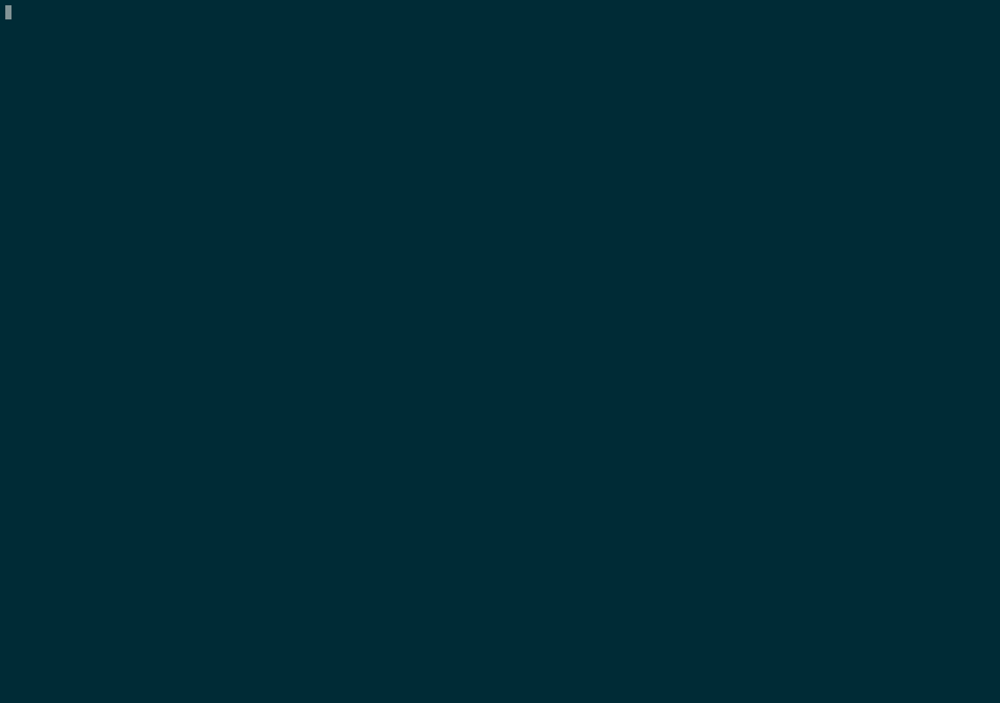

# Adventure Game

[See my blog post about this](https://blog.sc.ott.land/What-if-Dungeons-and-Dragons-had-a-game-engine-powered-by-AI/)

Adventure Game is a text-based adventure game written in Python using the `instructor` library and OpenAI's GPT model. This project was developed in just a few hours due to limited free time.



## Getting started with using the Devcontainer

This project includes a devcontainer configuration for Visual Studio Code. To use it:

1. **Open the Project in VS Code**: Open the project directory in Visual Studio Code.

2. **Reopen in Container**: When prompted, or by clicking on the green button in the bottom-left corner, select "Reopen in Container". This will build the container defined in `.devcontainer/Dockerfile` and set up the development environment.

3. **Install Dependencies**: Once Poetry is installed, navigate to the project directory and run:
    ```sh
    poetry install
    poetry shell
    ```

4. **Run the Game**: Start the game by running:
    ```sh
    python3 main.py
    ```

5. **Follow the Prompts**: The game will guide you through various scenarios. Type your actions as prompted.

6. **Exit the Game**: Type `quit` when you want to exit the game.
