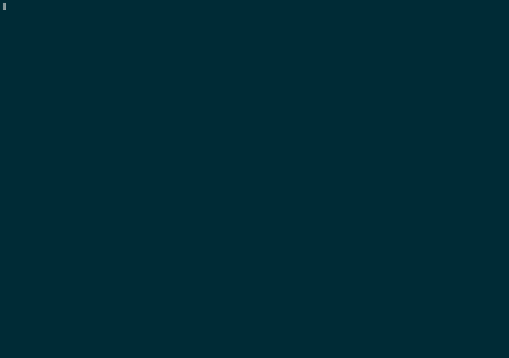

# Adventure Game

A text-based adventure game built with Python.

## Development Setup

This project uses [uv](https://github.com/astral-sh/uv) for dependency management and virtual environment handling.

### Prerequisites

- Python 3.12 or higher
- uv package manager (`pip install uv`)

### Installation

1. Clone the repository:
```bash
git clone <repository-url>
cd adventure-game
```

2. Create and activate a virtual environment:
```bash
uv venv
source .venv/bin/activate  # On Unix/macOS
# or
.venv\Scripts\activate  # On Windows
```

3. Install dependencies:
```bash
uv pip install -e .
```

### Project Structure

```
adventure-game/
├── adventure_game/     # Main package directory
│   └── __init__.py
├── pyproject.toml      # Project configuration and dependencies
└── README.md
```

### Managing Dependencies

All dependencies are managed in `pyproject.toml`. To add a new dependency:

1. Add it to the `dependencies` list in `pyproject.toml`
2. Run `uv pip install -e .` to install it

## License

[License information here]

[See my blog post about this](https://blog.sc.ott.land/What-if-Dungeons-and-Dragons-had-a-game-engine-powered-by-AI/)

Adventure Game is a text-based adventure game written in Python using the `instructor` library and OpenAI's GPT model. This project was developed in just a few hours due to limited free time.



## Getting started with using the Devcontainer

This project includes a devcontainer configuration for Visual Studio Code. To use it:

1. **Prerequisites**: 
   - Install [Visual Studio Code](https://code.visualstudio.com/)
   - Install the [Remote - Containers](https://marketplace.visualstudio.com/items?itemName=ms-vscode-remote.remote-containers) extension
   - Install [Docker](https://www.docker.com/products/docker-desktop)

2. **Open the Project in VS Code**: Open the project directory in Visual Studio Code.

3. **Reopen in Container**: When prompted, or by clicking on the green button in the bottom-left corner, select "Reopen in Container". This will:
   - Build the container defined in `.devcontainer/Dockerfile`
   - Set up the development environment with uv
   - Create a virtual environment and install all dependencies automatically

4. **Run the Game**: Start the game by running:
   ```sh
   python3 main.py
   ```

5. **Follow the Prompts**: The game will guide you through various scenarios. Type your actions as prompted.

6. **Exit the Game**: Type `quit` when you want to exit the game.
